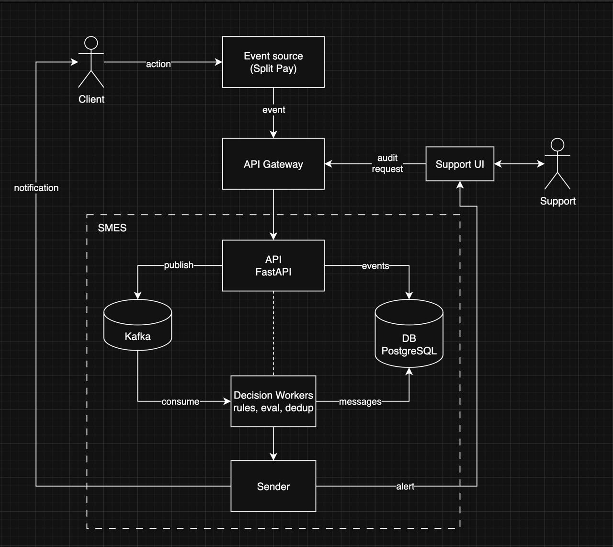

# Full-Scale Architecture Showcase

## 1. Цель решения

Построить marketing event service, который:
- надежно принимает и обрабатывает большой поток событий;
- гарантирует идемпотентное принятие решений по сообщениям;
- обеспечивает устойчивую доставку уведомлений с retry и DLQ;
- предоставляет аудит по сообщениям и событиям пользователей для Growth/CX/Support;
- позволяет безопасно развивать правила без риска регрессий.

## 2. Требования к полнофункциональному решению

Функциональные:
- прием входящих событий через `POST /events`;
- вычисление правил с учетом контекста пользователя и истории событий;
- дедупликация/suppression по политикам уведомлений;
- формирование send-intent и доставка через внешних провайдеров;
- внутренние алерты (например, `HIGH_RISK_ALERT`);
- аудит через `GET /audit/{user_id}` с полной историей решений.

Нефункциональные:
- горизонтальная масштабируемость и устойчивость к пиковым нагрузкам;
- наблюдаемость (метрики, логи, трейсинг, алерты);
- безопасность данных и соответствие compliance-требованиям;
- управляемая эволюция правил (версионирование, rollback, dry-run).

## 3. Компоненты системы

Компоненты (по диаграмме):
- `Client` - конечный пользователь, чьи действия в продукте порождают бизнес-события.
- `Event source (Split Pay)` - соседний сервис-источник, отправляет события в SMES.
- `API Gateway` - внешний вход в SMES, точка auth/rate limiting/policy enforcement.
- `Support UI` - внутренний интерфейс для команды Support/CX (audit-запросы и просмотр алертов).
- `API FastAPI` - HTTP-слой сервиса, принимает события, отдает аудит, пишет входные события в БД, публикует события в Kafka.
- `Kafka` - событийная шина, decoupling между API и асинхронными воркерами.
- `Decision Workers` - асинхронные обработчики, которые читают события из Kafka, применяют правила и дедуп, формируют message decisions.
- `DB PostgreSQL` - операционное хранилище (входные события, решения, аудитные данные).
- `Sender` - модуль доставки и внутренних нотификаций (внешние провайдеры + internal alert channel).
- `Support` - внутренний пользователь, который работает через `Support UI`.

Границы:
- Пунктирный прямоугольник `SMES` объединяет внутренние компоненты сервиса (`API`, `Kafka`, `Decision Workers`, `DB`, `Sender`).
- Пунктирная связь `API -> Decision Workers` обозначает логическую принадлежность к одному приложению/домену, при этом runtime-взаимодействие асинхронное через Kafka.

## 4. Технологический стек

- `Python 3 + FastAPI` - API-слой для ingest и audit endpoints.
- `Kafka` - асинхронная событийная шина между API и decision workers.
- `PostgreSQL` - основное операционное хранилище (events, decisions, audit).
- `Decision Workers` (Python) - фоновая обработка правил, дедупликации и формирования решений.
- `Sender` (provider adapters) - интеграция с внешними каналами доставки и внутренним alert-каналом.
- `API Gateway` - аутентификация, авторизация, rate limiting, централизованные policy.
- `Docker + Kubernetes` - контейнеризация, оркестрация и горизонтальное масштабирование.
- `Prometheus + Grafana + OpenTelemetry` - метрики, трейсинг, алерты и базовая наблюдаемость.
