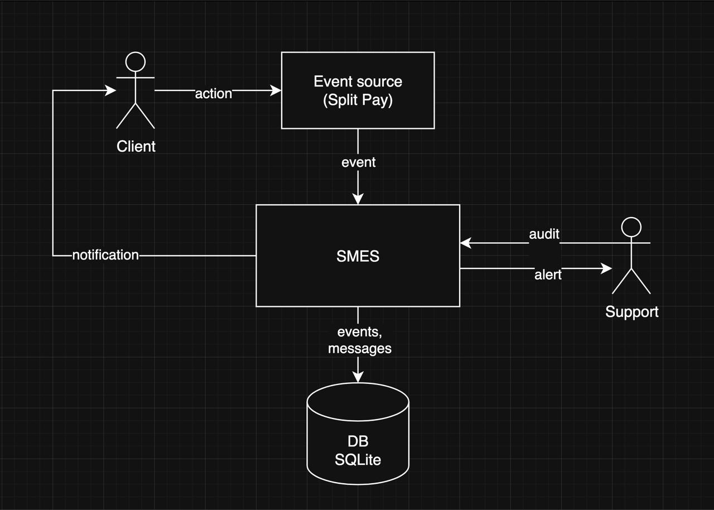

# SplitPay Marketing Event Service (SMES)

# MVP Architecture Showcase

## 1. Цель решения

Построить надежный MVP-сервис, который:
- принимает inbound-события;
- применяет правила коммуникаций;
- делает дедупликацию/suppression;
- фиксирует решения для аудита;
- объясняет, почему сообщение отправлено или подавлено.

## 2. Требования задания (суть)

Функциональные:
- `POST /events` для ingest;
- правила для отправки уведомлений
  - `WELCOME_EMAIL`
  - `BANK_LINK_NUDGE_SMS`
  - `INSUFFICIENT_FUNDS_EMAIL`
  - `HIGH_RISK_ALERT`
- дедупликация записей - suppression (once-ever, once-per-day);
- outbound send request (заглушка);
- `GET /audit/{user_id}` с историей событий и решений.

Нефункциональные:
- простота и скорость реализации;
- надежность и предсказуемость поведения;
- объяснимость для Growth/CX.

## 3. Границы MVP

Входит в MVP:
- один backend-сервис (FastAPI);
- rule evaluation в синхронном request-path;
- SQLite + SQLAlchemy + Alembic;
- полнота audit trail на уровне решений.

Не входит:
- асинхронные очереди, retry, DLQ;
- внешняя rule-платформа;
- интеграция с реальным провайдером доставки;
- auth/rate limit/idempotency key.

## 4. Компоненты системы



Компоненты:
- `Client` - конечный пользователь, выполняющий действия в SplitPay.
- `Event source (Split Pay)` - источник бизнес-событий, отправляет события в `SMES`.
- `SMES` - сервис обработки событий: применяет правила, дедупликацию/suppression, формирует решения и аудит.
  - `Routes` (`/events`, `/audit/{user_id}`).
  - `EventService` - управление обработкой
  - `Rule Engine` - правила и методы их применения
  - `Repository` - операции в БД
  - `Sender` (channel-based stub: `email`, `sms`, `internal_alert`).
- `Support` - внутренний потребитель аудита и алертов (`GET /audit/{user_id}`, `HIGH_RISK_ALERT`).
- `DB SQLite` - хранилище таблиц `events` и `messages`.


## 5. API

### `POST /events`

Принимает событие, к которому применяются правила рассылки. По итогам обработки вызывается stub-отправка соответствующих уведомлений.
В качестве ответа возвращает статус как результат обработки события.

#### Request body

```json
{
  "user_id": "string",
  "event_type": "signup_completed",
  "event_timestamp": "2026-03-04T22:49:38.290Z",
  "properties": {
    "additionalProp1": {}
  },
  "user_traits": {
    "additionalProp1": {}
  }
}
```

#### Response

```json
{
  "status": "ok"
}
```

### `GET /audit/{user_id}`

Агрегирует данные по указанному пользователю и возвращает аудит по связанным событиям и сообщениям.

```json
{
  "user_id": "string",
  "events": [
    {
      "id": 0,
      "user_id": "string",
      "event_type": "string",
      "event_timestamp": "2026-03-04T22:56:07.586Z",
      "raw_payload": {
        "additionalProp1": {}
      }
    }
  ],
  "message_decisions": [
    {
      "id": 0,
      "user_id": "string",
      "template_name": "WELCOME_EMAIL",
      "channel": "string",
      "timestamp": "2026-03-04T22:56:07.586Z",
      "reason": "string",
      "status": "string",
      "suppression_reason": "string"
    }
  ]
}
```

## 6. Модели данных

### `events`

```
Event:
  id: Integer (PK)
  user_id: String (index)
  event_type: String (index)
  event_timestamp: DateTime
  raw_payload: JSON string
```

### `messages`

```
Message:
  id: Integer (PK)
  user_id: String (index)
  template_name: String (index)
  channel: String
  timestamp: DateTime
  reason: String
  status: String (index)
  suppression_reason: String (nullable)
```

## 7. Технологический стек

- `Python 3 + FastAPI` - API-слой и оркестрация обработки событий.
- `Pydantic` - валидация входных данных и нормализация типов.
- `SQLAlchemy (async)` - доступ к БД и репозиторный слой.
- `SQLite` - простое локальное хранилище для MVP (`events`, `messages`).
- `Alembic` - миграции схемы БД.
- `Uvicorn` - ASGI-сервер для запуска приложения.
- `Docker + docker compose` - воспроизводимый запуск окружения (контейнеризация и оркестрация).
- `Pytest` - тестирование API и бизнес-логики.

## 8. Обработка событий

#### Политики дедупа:

- `ONCE_EVER`: поиск последнего `sent` по `(user_id, template_name)`.
- `ONCE_PER_UTC_DAY`: поиск `sent` по `(user_id, template_name)` в UTC-окне дня события.
- `NONE`: без suppression.

#### Текущие правила:

- `signup_completed` + `marketing_opt_in=true` -> `WELCOME_EMAIL` (`ONCE_EVER`)
- `link_bank_success` и `signup_completed` в последние 24ч -> `BANK_LINK_NUDGE_SMS` (`NONE`)
- `payment_failed` + `failure_reason=INSUFFICIENT_FUNDS` -> `INSUFFICIENT_FUNDS_EMAIL` (`ONCE_PER_UTC_DAY`)
- `payment_failed` + `attempt_number>=3` -> `HIGH_RISK_ALERT` (`NONE`)


#### Поведение:
- если дедуп срабатывает -> создается запись `suppressed` с `suppression_reason`;
- если дедуп не срабатывает -> создается `sent` + вызов sender (заглушка).

## 9. Готовность и ограничения

#### Реализовано:
- Получение и обработка событий
- Проведение аудита событий и уведомлений по пользователям
- Stub-отправка уведомлений по каналам (`email`, `sms`, `internal_alert`)
- Транзакционность обработки событий;
- Строгая валидация входа;
- Детерминированные и расширяемые правила (`Rule` + `MessageCandidate`);
- Дедупликация и suppression с сохранением причин;
- Тестовое покрытие ключевых сценариев.

#### Ограничения:
- отсутствие аутентификации и авторизации;
- не реализована реальная отправка уведомлений пользователям;
- synchronous request-path;
- риск гонок дедупа при высоком параллелизме;
- нет retry-механизма при реальной интеграции провайдера;
- ограниченная масштабируемость под высокой нагрузкой (single-instance + SQLite, без очередей и горизонтального масштабирования);
- нет подтверждений фактической доставки (delivery receipts) от внешних провайдеров;
- нет идемпотентности входящих событий (`event_id`/idempotency key).
